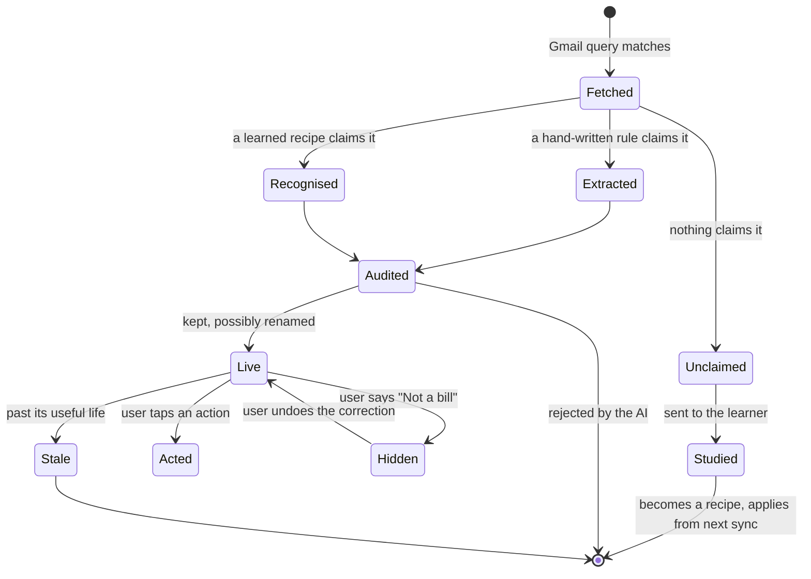
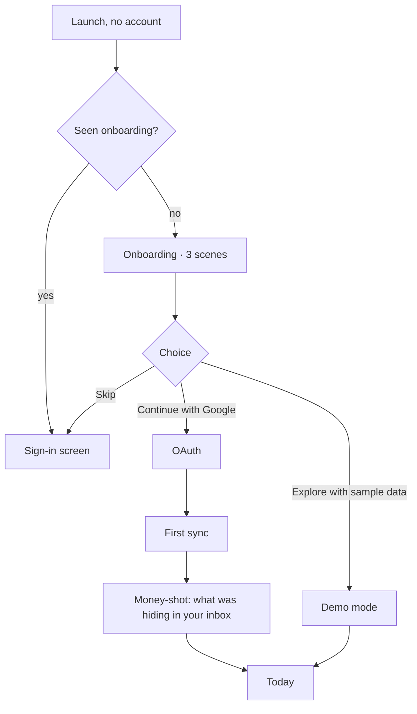
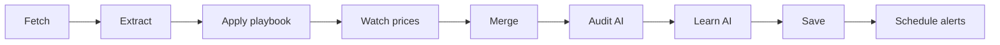
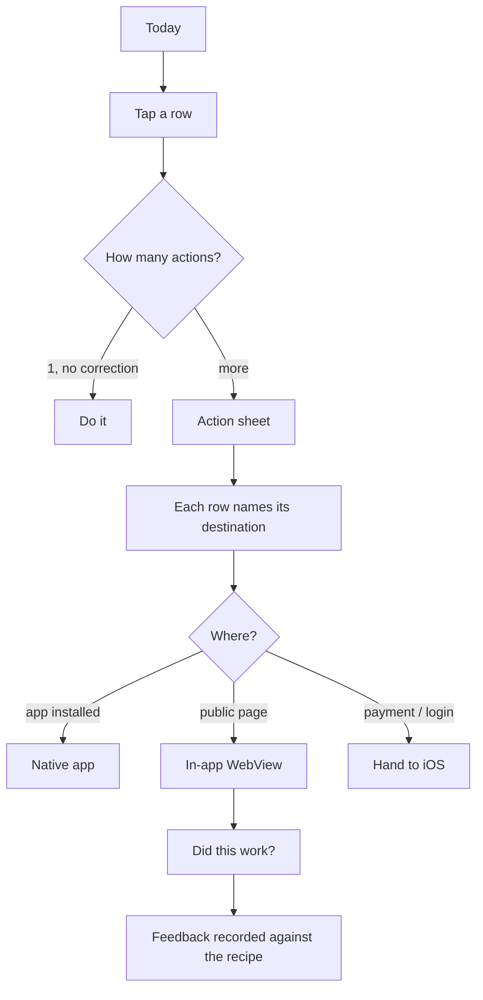
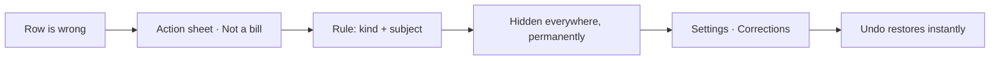
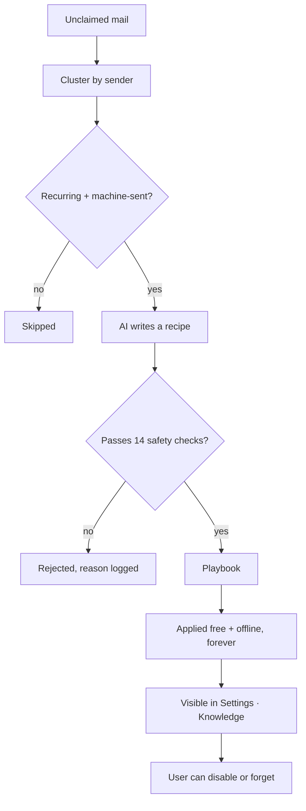

# NoMail — Product Requirements

> Written 2026-08-07 against the code as it stands at `b4bd31a`. This is the
> **flow-level** document: states, transitions, decision points and edge cases.
> It deliberately does not repeat [[One App Vision]] (the long-range thesis and
> monetisation), [[Architecture]] (how it is built) or [[Roadmap]] (build order).
> Where a behaviour below is not yet built it is marked **○ Not built**.

---

## 1. What this is

**One sentence.** NoMail reads a Gmail mailbox and renders only the things that
need doing, each carrying the link that finishes it.

**One paragraph.** Email is the receipts layer of digital life — every bank,
merchant, airline, school and government office mails you — but an inbox is a
chronological list of *documents*, not a list of *obligations*. NoMail treats
Gmail as a read-only backend and the app as the surface: it extracts bills,
renewals, parcels, meetings, price rises and anything else it can learn to
recognise, ranks them by what is actually pressing, and gives each one the tap
that resolves it. It gets smarter with use, because when it meets a shape it
does not know it writes itself a rule and applies that rule free and offline
forever after.

### Non-goals — stated so they stop being re-litigated

| Not this | Why |
|---|---|
| An email client | No compose, reply, send, archive, label or delete. Scope is `gmail.readonly` and the app is *incapable* of those actions, by design. This was a deliberate pivot on 2026-08-01 (see [[Requirements]]). |
| An inbox-zero tool | NoMail never changes the mailbox. Hiding a card hides a card. |
| A chat assistant | There is no prompt box. AI runs in fixed places with fixed jobs. |
| A server product | Insights live only on the device. There is no NoMail account. |

---

## 2. The user

**Primary.** India-first, then US. Has 200–2000 unread, pays 6–15 recurring
subscriptions they have partly lost track of, misses a bill or a return window
occasionally, and has three payment apps but no idea which one a given bill
needs.

**The five jobs**, in the order they matter:

1. *Tell me what needs doing today* — without me reading anything.
2. *Don't let me miss a deadline* — a due date, a renewal, a return window.
3. *Show me what I am actually paying* — and when it quietly goes up.
4. *Take me to the right place in one tap* — the tracking page for **this**
   parcel, not the courier's homepage.
5. *Be honest with me* — about what you read, what you sent to a model, what it
   cost, and what you got wrong.

Job 5 is not decoration. It is the whole reason a privacy-sensitive user hands
over a mailbox, and every trust surface in the app exists to serve it.

---

## 3. The core object: an insight

Everything in the app is one of these. Understanding its lifecycle is
understanding the product.

### Anatomy

| Field | Purpose | Failure if missing |
|---|---|---|
| Title | Who it is about | "CRED" — names the gateway, not the biller |
| Note / subtitle | What it actually is | Row is a name and a number with no meaning |
| Trailing value | The amount or the verb | User must open it to learn the stake |
| Caption | When it matters | No urgency signal |
| Anchor date | Drives ranking + tier | Sinks below trivia |
| Actions | The tap that resolves it | Becomes a notification, not a tool |
| `sourceEmailId` | Reader + explain + audit | Cannot be explained or corrected |

### Ranking — the contract

Sorted by **urgency tier** → **weight** → **soonest anchor**.

Tiers: `imminent` (< 6h or overdue) · `near` (≤ 72h) · `ambient` (everything else).

| Weight | Insight |
|---|---|
| 100 | Security / attention |
| 92 | Failed payment |
| 90 | Overdue bill |
| 85 | Price change |
| 80 | Travel, check-in open |
| 78 | Refund |
| 74 | Learned card *with* money and a date |
| 70 | Bill due |
| 65 | Travel booked |
| 62 | Learned card with money only |
| 60 | Parcel out for delivery |
| 58 | Return window |
| 56 | Learned card with a date only |
| 55 | Subscription renewal |
| 50 | Meeting |
| 45 | Parcel in transit |
| 30 | Learned card, bare |
| 20 | Reads |

**Rule:** a learned card must never outrank the equivalent hand-written one.
The app's least certain output cannot sit above its most certain.

---

## 4. Flows

### 4.1 First run

**Onboarding scenes** — each demonstrates a real capability rather than
asserting a benefit:

| # | Headline | Shows |
|---|---|---|
| 1 | Your inbox, minus the inbox | Six real subjects sort themselves; three become insights, three fade |
| 2 | Money moves quietly | ₹1,737/mo across 6 subscriptions, one price rise marked |
| 3 | One tap, the right place | Three actions naming their destination before you tap |

**Rules.** Skip must be available on every scene. Onboarding is replayable from
Settings. Nothing here claims a feature the app does not have.

**Open question →** Should sign-in offer a *scope preview* ("NoMail will read,
never send") before the Google sheet? Google's own consent screen says it, but
ours is the one the user trusts. *Recommendation: yes, one line on scene 3.*

### 4.2 Sync — the engine

Seven Gmail queries: receipts · bills · packages · meetings · reads · travel ·
**anything new**. The last is unconstrained by keywords and is what lets the app
learn categories nobody hardcoded.

**Ordering constraints that are load-bearing:**

- Price watch runs **before** merge, because merge collapses subscriptions by
  service name and destroys the old amount.
- Learning runs **after** the audit, so it never delays the brief, and its
  recipes take effect from the *next* sync.
- Every AI step is optional. With no key, rules carry the whole load.

**Failure behaviour.** A dead query or dead message is skipped, not fatal — a
scan returning most of the mail beats one returning an error. Total failure
throws, because an unreachable Gmail must not render as "your inbox is empty".

**Open question →** Sync is manual (pull-to-refresh) plus an 8am brief. Should
it run in the background on app open? *Recommendation: yes, if last sync > 4h,
silently, with the existing progress line.* **○ Not built.**

### 4.3 Glance → act

**The destination promise.** Every action row says where it lands *before* the
tap: brand mark + name for a native app, a globe for "in NoMail", an out-arrow
for "leaves". A tap that leaves the app unexpectedly is the single most disliked
thing about deep links.

**Long-press any row** → AI reads the actual email and explains it in 2–3
sentences, and is told to correct the app's own label if the label misleads.
Offered only when it can be answered (needs sign-in + key), because a gesture
that always apologises teaches the user to stop trying it.

### 4.4 Correction — the user is the ground truth

A rule is **(kind, subject)**, not an email id — "GitHub is not a delivery" has
to still be true next week. Filtering happens on the way *out* of the store, so
undo needs no rescan and the next sync's merge still sees the whole truth.

### 4.5 Learning — how the app grows

The learner is capped per sync (5 clusters), skips shapes it already knows, and
treats model output as hostile — regexes are probed, domains must appear in the
real cluster, templates must be `https:` or `upi:`.

**Link feedback closes the loop:** two thumbs-down and no successes marks a
recipe suspect, surfaced in Knowledge → Needs review. Login walls are excluded
from that count, because a WKWebView carries no cookies and would otherwise
convict correct recipes.

---

## 5. Screens and their states

The states that get forgotten are the ones that ship broken, so they are
enumerated.

| Screen | Purpose | Empty | Loading | Error |
|---|---|---|---|---|
| **Today** | The glance | "No Insights Yet" + Scan | Live stage line | Inline, under Sync |
| **Money** | Spend + price rises | "No Money Insights Yet" | Skeleton rows | — |
| **Timeline** | Everything, chip-filtered | "Nothing Yet" | Skeleton | — |
| **Settings** | The trust surface | — | — | Inline per action |
| **Brief** | Full daily summary | "No Brief Yet" | — | — |
| **Knowledge** | Learned recipes | "Nothing Learned Yet" | — | — |
| **Corrections** | What you hid | "Nothing Hidden" | — | — |
| **Processing** | What the last sync did | "No scan yet" | Live | Names the failure |
| **AI** | Key, model, spend | "Add your key" | "Checking…" | Reason + retry |
| **Scanning** | Scope + cost estimate | — | — | "AI cost unknown" |
| **Reader** | The email, in-app | — | Spinner | Falls back to web |

**Today's composition, in order:** brief card → stat strip → Needs attention →
Coming up → All clear (if nothing pressing) → sync footnote.

---

## 6. Trust surfaces — Job 5 made concrete

| Surface | Answers |
|---|---|
| Settings → AI | Is a key set, does it work *right now*, which model, what has it spent |
| Settings → Scanning | How much mail, how far back, **and what it will cost** |
| Settings → Processing | What the last sync read, found, and what the AI changed |
| Settings → Knowledge | Every rule the app wrote itself; disable or forget |
| Settings → Corrections | Everything you hid; undo |
| Brief screen | Who wrote this summary — AI or rules — and from how much mail |
| Action rows | Where this tap lands, before you take it |

**Principle: never ship a number the app cannot defend.** The scan estimate uses
live OpenRouter pricing and shows nothing when that fails; the Money hero says
"vs before", not "saved", because the app can prove a price moved but not that
the user cancelled anything.

---

## 7. Notifications

| Trigger | When | Payload |
|---|---|---|
| Daily brief | 08:00, user-configurable | Opens Today |
| Renewal | T−2 days, 09:00 | Manage link |
| Bill due | T−1 day, 09:00 | Pay link |
| Return window | T−1 day, 09:00 | Return link |

Rebuilt from scratch each sync rather than maintained: the builder is pure, and
the scheduler cancels its own id namespace first — so a bill that got paid
simply stops being scheduled.

**Open question →** The daily brief fires whether or not there is anything to
say. Should it suppress on an empty day? *Recommendation: yes — a notification
that says "nothing today" every day trains dismissal.* **○ Not built.**

---

## 8. Open decisions

These need a product answer, not a technical one. My recommendation is given,
but the call is yours.

| # | Decision | Recommendation |
|---|---|---|
| D1 | Brief history — one at a time today, no yesterday | Store last 7. Cheap, and "again" is a real ask. |
| D2 | Discovery default-on reads *all* recent mail | Keep on, but say so explicitly at sign-in. It is the honest disclosure moment. |
| D3 | Old recipes from the pre-2026-08-06 prompt may produce poor cards | Add "Forget all learned recipes" to Knowledge. |
| D4 | Background sync on open | Yes if stale > 4h. |
| D5 | Free vs Pro split | Free: 1 account, rules only. Pro: multi-account, AI brief + audit, price alerts, backup. |
| D6 | What happens on Pro expiry | Degrade to rules, never delete insights. |
| D7 | Empty-day brief notification | Suppress. |
| D8 | Learned cards the user never taps | After 3 ignored appearances, demote — do not hide. |

---

## 9. Status — built vs not

**Built and tested** (786 tests): extraction across 9 domains · learned playbook
with discovery · price-hike detection · corrections · link feedback · deep-link
routing across 44 apps · in-app reader · action sheets with destination hints ·
long-press explain · brief + brief screen · proactive alerts · multi-account ·
backup/restore · onboarding · the whole Settings trust surface.

**Built but never run against a real mailbox** — the honest gap. Every test uses
fixtures. Discovery and the learner have never met a real inbox, so the quality
of the recipes a real model writes on real mail is **unknown**.

**Not built:** brief history · background sync · empty-day suppression · widget
and Live Activity · unused-subscription heuristic · annual spend report ·
Free/Pro split and IAP.

**Ship blockers:** `.env` ships inside the IPA (needs a server-side key proxy) ·
Google CASA Tier 2 for the restricted scope · OpenRouter key rotation with a
spend cap · paid Apple membership for TestFlight.

---

## 10. How we would know it works

| Question | Measure |
|---|---|
| Does the glance replace reading? | Sessions where the user acts without opening an email |
| Is extraction right? | Corrections per 100 insights — target < 3 |
| Is the app learning? | Recipes after 30 days; share of insights from recipes |
| Do links land? | Thumbs-up rate; suspect recipes per 100 |
| Is it worth paying for? | Price rises caught per user per quarter |
| Is it trusted? | Share who open Settings → Processing at least once |

The first two are the honest ones. If corrections per 100 is high, nothing else
matters — the app is confidently wrong, which is worse than being absent.

---

Related: [[One App Vision]] · [[Architecture]] · [[Roadmap]] · [[Settings Plan]]
· [[Actions API]] · [[Development Log]]
